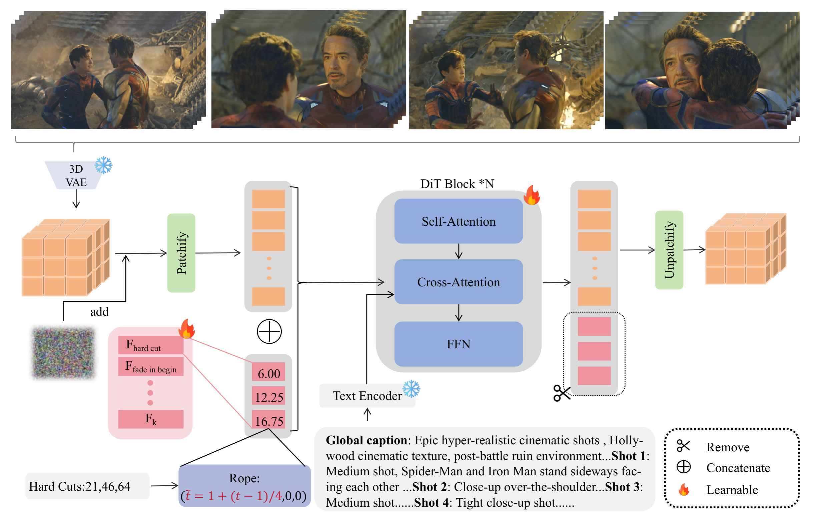

<div align="center">

# ShotPlan: Cinematic Video Generation with Learnable Planning Token

<p align="center">
  <a href="https://pensioner-11.github.io/ShotPlan/"><b>🌐 Project Page</b></a>
  &nbsp;·&nbsp;
  <b>📄 Paper (arXiv coming soon)</b>
  &nbsp;·&nbsp;
  <a href="https://huggingface.co/Pensioner/ShotPlan-Wan2.2-T2V-A14B-HighNoise"><b>🤗 Model</b></a>
  &nbsp;·&nbsp;
  <a href="https://huggingface.co/datasets/Pensioner/shotplan"><b>🗂️ Dataset</b></a>
</p>

**Su Guo**<sup>\*</sup> · **Guangce Liu**<sup>\*</sup> · Haosen Yang · Jiepeng Wang · Cong Liu · Junqi Liu · Haibin Huang · Hongxun Yao · Chi Zhang · Xuelong Li

</div>

---

Official implementation of **ShotPlan**, a framework for controllable multi-shot (cinematic) video generation built on Wan video diffusion models.

ShotPlan lets you specify **exact frame indices where hard cuts should happen** in a generated video. It introduces:

- **Learnable planning tokens** — a single learnable token, replicated per user-specified transition, is concatenated with the visual tokens and processed by the DiT as an in-context conditioning signal. No attention masks, no architectural surgery.
- **Fractional Temporal RoPE (FRoPE)** — video diffusion models operate in a temporally compressed latent space (4 physical frames per latent step), so cut timestamps rarely align with integer latent indices. Planning tokens are assigned *fractional* temporal RoPE coordinates (`t = 1 + frame/4`), enabling frame-level transition control while visual tokens keep the original pretrained RoPE.

After denoising, the planning tokens are discarded — output shape and decoding are unchanged from the base model.

## Model Zoo

| Model | Base | HuggingFace |
|---|---|---|
| ShotPlan-Wan2.2-T2V-A14B-HighNoise | [Wan2.2-T2V-A14B](https://huggingface.co/Wan-AI/Wan2.2-T2V-A14B) (high-noise expert) | [Pensioner/ShotPlan-Wan2.2-T2V-A14B-HighNoise](https://huggingface.co/Pensioner/ShotPlan-Wan2.2-T2V-A14B-HighNoise) |
| ShotPlan-Wan2.1-T2V-14B | [Wan2.1-T2V-14B](https://huggingface.co/Wan-AI/Wan2.1-T2V-14B) | [Pensioner/ShotPlan-Wan2.1-T2V-14B](https://huggingface.co/Pensioner/ShotPlan-Wan2.1-T2V-14B) |

Training data: [Pensioner/shotplan](https://huggingface.co/datasets/Pensioner/shotplan) (6.4K multi-shot samples curated from [VidEvent](https://arxiv.org/abs/2506.02448) with TransNet V2 + Gemini 2.5).

## Installation

```bash
git clone https://github.com/Pensioner-11/ShotPlan.git
cd ShotPlan
pip install -r requirements.txt
```

The repository vendors a trimmed copy of [DiffSynth-Studio](https://github.com/modelscope/DiffSynth-Studio) (`diffsynth/`, Apache-2.0) with ShotPlan's modifications in `diffsynth/core/data/custom_*.py` and `diffsynth/core/data/data_profiles.py`. Run all commands from the repository root (or add it to `PYTHONPATH`).

## How it works

<div align="center">
  
</div>

Latents are patchified as usual; for a request like hard cuts at frames 21, 46, 64, three copies of the learnable planning embedding are appended with fractional temporal positions 6.00, 12.25, 16.75. They attend jointly with the visual tokens through every DiT block, and are dropped before unpatchify — so output shape and decoding are unchanged from the base model.

## Inference

We recommend using the **Wan2.2** model for better results.

### 1. Download a base model

**Download** [Wan-AI/Wan2.2-T2V-A14B](https://huggingface.co/Wan-AI/Wan2.2-T2V-A14B) (recommended) or [Wan-AI/Wan2.1-T2V-14B](https://huggingface.co/Wan-AI/Wan2.1-T2V-14B) into `./models/`.

### 2. Download the matching ShotPlan checkpoint

**Download** [ShotPlan-Wan2.2-T2V-A14B-HighNoise](https://huggingface.co/Pensioner/ShotPlan-Wan2.2-T2V-A14B-HighNoise) (recommended) or [ShotPlan-Wan2.1-T2V-14B](https://huggingface.co/Pensioner/ShotPlan-Wan2.1-T2V-14B).

### 3. Generate

Prompts follow a hierarchical format: a global scene description followed by per-shot captions. `--cut_at` takes frame indices (81-frame video @ 16 fps).

**Wan2.2 (MoE, recommended):**

```bash
python inference/infer_wan22.py \
    --wan22_root ./models/Wan2.2-T2V-A14B \
    --ckpt ./models/shotplan_wan22/<checkpoint>.safetensors \
    --prompt "A rainy neon-lit street at night. Shot 1: Wide shot, a woman in a red coat walks toward the camera under an umbrella. Shot 2: Close-up of her face, rain drops on her cheek, neon reflections in her eyes." \
    --cut_at 26,64 \
    --output_dir ./results
```

**Wan2.1:**

```bash
python inference/infer_wan21.py \
    --model_root ./models/Wan2.1-T2V-14B \
    --ckpt ./models/shotplan_wan21/<checkpoint>.safetensors \
    --prompt "..." \
    --cut_at 40 \
    --output_dir ./results
```

Both scripts also support batch mode over multiple GPUs:

```bash
python inference/infer_wan21.py \
    --model_root ./models/Wan2.1-T2V-14B \
    --ckpt <ckpt> \
    --json_path tasks.json \      # [{"id": "...", "prompt": "...", "cut_at": "26,64"}, ...]
    --gpus 0,1,2,3
```

## Training

### Data

**Download** the [ShotPlan dataset](https://huggingface.co/datasets/Pensioner/shotplan) and point `METADATA` at the metadata JSON. Each record:

```json
{
  "file_path": "videos/V000001_16fps.mp4",
  "start_frame": 102,
  "end_frame": 182,
  "cut_at": [26, 64],
  "type": "hardcut",
  "text": "Global caption ... Shot 1: ... Shot 2: ..."
}
```

`cut_at` is in frames relative to `start_frame`. See the [dataset card](https://huggingface.co/datasets/Pensioner/shotplan) for details. To train on your own data, produce the same format (shot detection with TransNet V2 works well) and make `file_path` resolvable from `--dataset_base_path`.

### Launch

Wan2.1-T2V-14B, full-parameter, 8 GPUs (DeepSpeed ZeRO-2 + CPU offload; configs in `train/`):

```bash
WAN21_ROOT=./models/Wan2.1-T2V-14B \
METADATA=./data/train_meta_16fps.json \
bash train/train_wan21.sh
```

Wan2.2-T2V-A14B high-noise expert only:

```bash
WAN22_ROOT=./models/Wan2.2-T2V-A14B \
METADATA=./data/train_meta_16fps.json \
bash train/train_wan22_highnoise.sh
```

The planning token is registered as a DiT parameter named `hardcut_embedding` (shape `[1, 1, dim]`) and optimized jointly with the DiT weights. For Wan2.2, `--max_timestep_boundary 0.358` restricts training to the high-noise segment of the flow-matching schedule, matching the MoE routing boundary.

## Acknowledgements

- Built on [DiffSynth-Studio](https://github.com/modelscope/DiffSynth-Studio) by ModelScope.
- Base models: [Wan2.1 / Wan2.2](https://github.com/Wan-Video) by Alibaba.
- Training data derived from [VidEvent](http://www.videvent.top); shot detection by [TransNet V2](https://github.com/soCzech/TransNetV2).

## License

Apache-2.0, inherited from DiffSynth-Studio (see `LICENSE`). This repository contains modifications to the original DiffSynth-Studio code. Model weights inherit the Apache-2.0 license of the Wan model family. The dataset carries its own research-only terms — see the dataset card.
